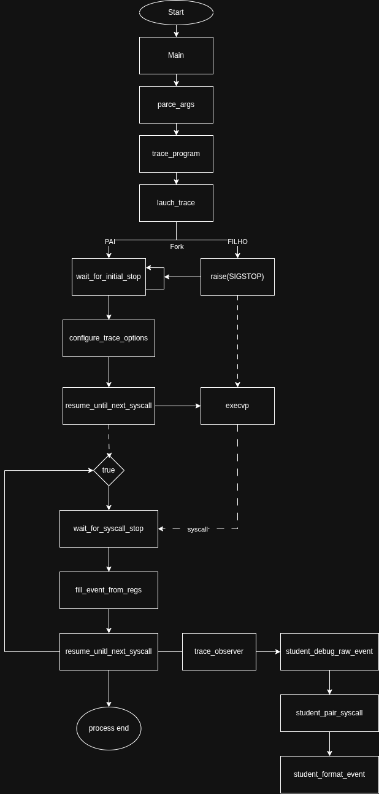

### Informações de cada código fonte localizado em /src

#### main.c (inicio do fluxo de execução):

- trace_observer: é a função de callback. Ela é chamada para fazer os logs dos eventos de syscall e juntar os pares de entrada e saida.

#### cli.c (biblioteca da interface de usuário):

- find_separator: acha o index do separador "--"
- print_usage: imprime o use da ferramenta com "--help"
- parse_args: função que engloba as função de cli

#### trace_runtime.c:

1.  TODO SEMANA 2:
    1. launch_tracee
    2. wait_for_initial_stop
2.  TODO SEMANA 3:
    1. configure_trace_options
    2. resume_until_next_syscall
    3. wait_for_syscall_stop
3.  TODO SEMANA 4:
    1. fill_event_from_regs
    2. trace_program

#### trace_helpers.c:

1.  read_child_string

#### student/formatter.c:

1.  student_debug_raw_event
2.  student_format_event (TODO SEMANA 5)

#### student/pairer.c:

1.  student_pair_syscall (TODO SEMANA 2)

#### Perguntas

Onde o programa começa?

- main

Onde o processo alvo é criado?

- launch_tracee no trace_runtime

Onde o runtime chama o callback?

- trace_observer na main

Quais são os arquivos que o grupo deve modificar?

- trace_runtime.c
- formatter.c
- pairer.c

Qual TODO aparece primeiro no scaffolding?

- TODO Semana 2

Qual a princícpal dúvida tecnica do grupo?

- Como o Ptrace interrompe processo durante a syscall

#### Fluxo de Execução do Programa

